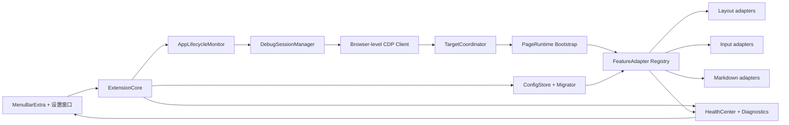
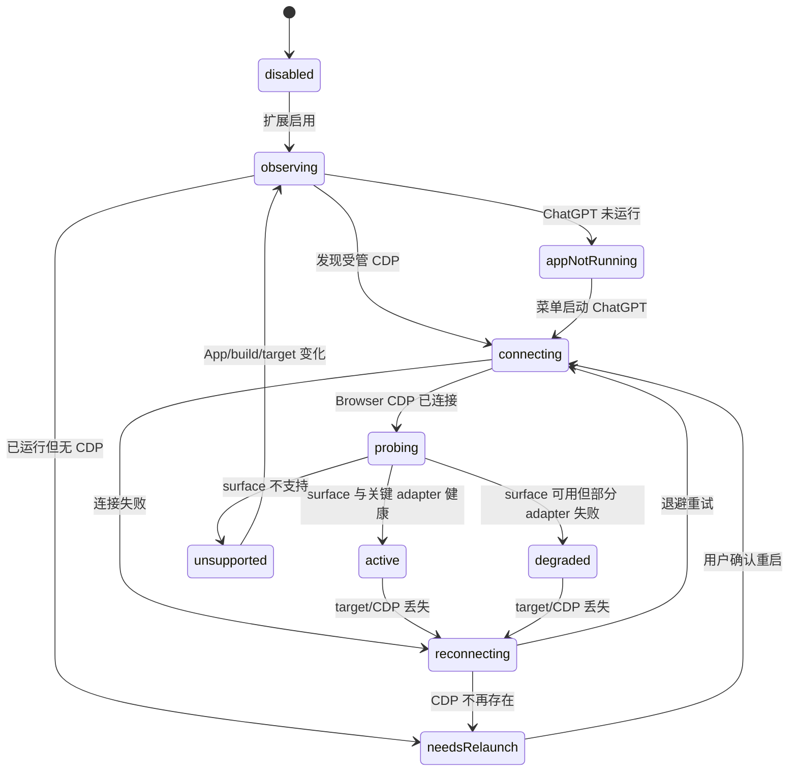
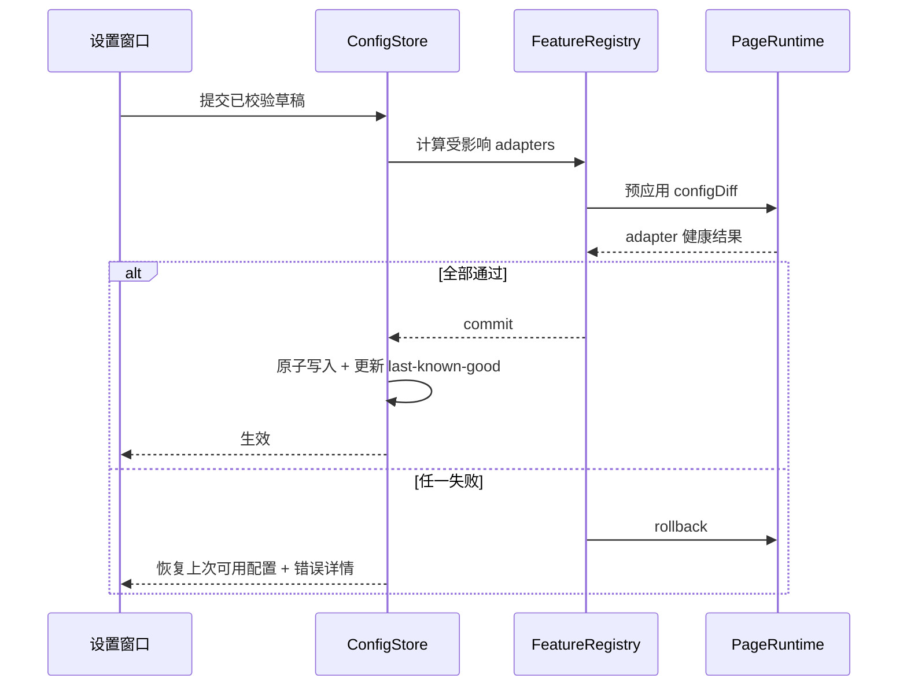

# Codex App Extension 菜单栏与运行时 V2 设计

## 文档状态

- 设计状态：用户已整体批准
- 设计日期：2026-08-03
- 目标平台：macOS
- 当前验证目标：`/Applications/ChatGPT.app` `26.727.51351`（build `6119`，bundle id `com.openai.codex`）
- 交付方式：运行时、菜单栏、设置窗口、配置迁移、诊断、旧链路清理一次性交付并统一验收

## 1. 背景与审计结论

当前项目仍能通过 `./verify.sh`，当前 ChatGPT 实例也能通过 `127.0.0.1:9229` 完成 CDP 诊断，但现有架构已经不适合继续按版本补丁演进：

- `inject-wide-layout.mjs` 已增长到 3578 行，页面布局、浮层、输入、主题、配置、CDP 和诊断耦合在一个文件中。
- `verify.sh` 已增长到 2872 行，大量验证依赖源码字符串、手写 DOM stub 和 `app.asar` 锚点存在性。
- ChatGPT `26.727.51351` 已移除 `.main-surface`；主题增强和顶部避让曾在静态验证全绿的情况下静默失效。
- 页面运行时存在根级 `MutationObserver`、多轮定时刷新、全 DOM 扫描、动态类名、几何猜测和本地化文本信号，容易形成误判与布局反馈环。
- 当前链路是一次性启动和注入。ChatGPT 未带 CDP 启动、target 重建、应用重启或升级后仍需要人工恢复。
- 配置没有 schema 版本、迁移器、事务写入、上次可用版本或统一的可视化契约。
- 新版 ChatGPT 已原生提供多行输入 Cmd+Enter、外观和快捷键设置，部分旧增强已失去独立价值。

因此本设计不延续“旧脚本拆文件再套 UI”的路线，而是重建原生 macOS 宿主、页面 adapter 运行时和配置/诊断契约。旧配置只迁移数据，旧运行时代码不进入 V2。

## 2. 产品目标

将仓库升级为名为 `Codex App Extension` 的原生 macOS 菜单栏 App：

- 常驻菜单栏，默认不显示 Dock 图标。
- 自动观察 ChatGPT 生命周期和 CDP target 生命周期。
- 在用户确认后安全重启未带 CDP 的 ChatGPT 实例。
- 每个增强功能独立安装、更新、诊断、降级和卸载。
- 提供菜单栏快速控制和独立设置窗口的完整可视化配置。
- 提供版本化配置、V1 配置迁移、原子应用、失败回滚和上次可用配置。
- 提供本地、脱敏、可导出的兼容与健康诊断。
- 在新 App 完整验收后删除旧 Shell/Node 产品链，不发布双实现。

### 2.1 成功标准

- 菜单栏、设置窗口、常驻恢复、配置迁移、诊断和全部获准 adapter 一起通过验收。
- 当前 ChatGPT 版本上，每项功能都有明确的 `healthy`、`degraded`、`unsupported` 或 `disabled` 状态。
- 任一 adapter 失败不影响其他 adapter，也不阻断 ChatGPT 原生功能。
- 页面 reload、target 重建和由本 App 启动的 ChatGPT 重启后自动重新附着。
- 不依赖系统 Node、ChatGPT 私有 `cua_node` 或仓库 Shell 启动脚本。
- 不修改 ChatGPT 应用包体、账号数据、Cookie、对话、输入内容或历史会话。

### 2.2 非目标

本期不建设：

- 云同步或账号体系。
- Codex Plugin、MCP 工具或 App Server 会话管理。
- 公开市场发布、自动更新后台或跨用户遥测。
- Windows/Linux 版本。
- 对旧独立 `Codex.app`、旧 DOM selector、旧 CLI 参数或 `CODEX_WIDE_*` 运行时兼容。

## 3. 已确认的清理边界

- 支持目标仅为当前产品形态 `ChatGPT.app`，bundle id 必须是 `com.openai.codex`。
- 旧 `~/.codex-app-extension/config.json` 只用于一次性迁移和备份，不再作为 V2 运行时配置源。
- 旧 CLI、环境变量和 selector 不保留运行时 adapter；迁移报告会明确列出已迁移、由原生接管、废弃和无法识别的字段。
- `longTextSendEnhancement` 删除。V2 提供跳转 `codex://settings`，由 ChatGPT 原生“多行输入要求 Cmd+Enter”设置接管。
- 其他现有功能必须通过资格审查后重写；不能稳定识别或不能失败开放的功能从首版移除，不允许为了“功能数量”保留脆弱实现。

该清理是用户明确批准的架构迁移，不属于静默删除。README、迁移报告和发布说明必须列出所有移除项及原生替代方式。

## 4. 总体架构

宿主采用 Swift，页面增强继续使用 JavaScript。Swift 负责 macOS 产品职责；JavaScript 只负责必须在 ChatGPT 页面上下文执行的 DOM/CSS/输入行为。

### 4.1 Xcode targets

- `CodexAppExtension`：SwiftUI App、`MenuBarExtra`、设置窗口、系统通知、登录启动。
- `ExtensionCore`：无 UI 的 Swift framework，包含生命周期、CDP、配置、feature registry 和诊断。
- `ExtensionCoreTests`：状态机、配置、CDP、迁移、回滚和日志测试。
- `PageRuntimeTests`：通过 `WKWebView` DOM fixture 执行真实 adapter JavaScript。
- `CodexAppExtensionUITests`：菜单栏和设置窗口主流程测试。

首版不引入第三方 Swift package。页面 JavaScript 作为 App resource 直接加载，不引入 npm、bundler 或第二套构建系统。

### 4.2 ExtensionCore 组件

#### `AppLifecycleMonitor`

- 通过 `NSWorkspace` 监听 ChatGPT 启动、终止和重新激活。
- 校验 app bundle 路径、bundle id、主进程 PID 和可执行文件身份。
- 不模糊匹配 helper，不终止未知进程。

#### `DebugSessionManager`

- 为由本 App 启动的 ChatGPT 选择随机回环高位端口。
- 只用 `--remote-debugging-address=127.0.0.1` 和随机 `--remote-debugging-port` 启动。
- ChatGPT 已运行但无 CDP 时进入 `needsRelaunch`，等待用户确认。
- 未经确认不得退出、重启或强制终止 ChatGPT。

#### `CDPClient`

- 连接 `/json/version` 返回的 Browser WebSocket，而不是只连接一次 page WebSocket。
- 使用 Browser/Target 事件发现 target 创建、销毁、重载和信息变化。
- 每个请求有超时、取消和连接代次；旧连接的迟到响应不得污染新状态。
- WebSocket 断开后采用有上限的指数退避和抖动重连。

#### `TargetCoordinator`

- 只接纳 `app://-/index.html` 且通过 Codex surface 能力指纹的 target。
- surface 探针优先使用稳定 data/ARIA/语义锚点；动态类名只能作为次级能力信号。
- target 通过后安装 `PageRuntime`；reload 或新 target 重新安装，旧 target 触发卸载和状态清理。

#### `FeatureRegistry`

- 读取 adapter manifest，解析能力依赖、配置 schema、冲突和默认状态。
- 独立执行每个 adapter 的 `install`、`update`、`diagnose`、`uninstall`。
- 单项错误隔离，聚合为全局健康状态。

#### `ConfigStore`

- 使用 Swift `Codable` 强类型模型。
- 负责 schema 校验、V1 迁移、草稿验证、原子写入和上次可用配置。
- 页面 adapter 只能收到自己的配置片段。

#### `HealthCenter`

- 聚合 App、CDP、surface、adapter、配置、性能和迁移状态。
- 向 SwiftUI 发布只读状态快照。
- 维护脱敏的有界事件环和轮转日志。

## 5. 页面运行时与 adapter 契约

### 5.1 PageRuntime

页面只暴露一个命名空间 `window.__codexAppExtensionV2`，负责：

- runtime 版本握手。
- adapter 注册和唯一 id 检查。
- 版本化 JSON envelope 路由。
- 共享、受范围约束的 observer bus。
- adapter 资源登记与幂等清理。
- 单 adapter 异常隔离和诊断结果序列化。

Swift 与 PageRuntime 的 envelope 固定包含：

- `runtimeVersion`
- `requestId`
- `adapterId`
- `operation`
- `config` 或 `configDiff`
- `result` 或结构化 `error`

### 5.2 FeatureAdapter

每个 adapter 必须提供：

- `manifest`：id、版本、配置版本、依赖能力、风险类别、默认状态。
- `probe(context)`：返回 `supported`、`unsupported` 或带原因的 `degraded`。
- `install(config)`：只创建本 adapter 拥有的资源。
- `update(configDiff)`：不重复安装，不影响其他 adapter。
- `diagnose()`：只返回结构、计数、状态、性能和错误码。
- `uninstall()`：幂等清理 style、attribute、observer、timer 和 event handler。

禁止：

- `body *` 或同等全 DOM 扫描。
- 用中英文 UI 文案识别功能。
- 在 selector/按钮/编辑器不唯一时强行接管。
- 把 Node、Swift 或文件系统 API 带入页面上下文。
- 读取或记录用户输入、对话正文、Cookie 或完整 DOM。

## 6. 功能重新准入

| 功能 | V2 处置 | 准入条件 |
|---|---|---|
| 宽屏布局 | 重写 | 稳定识别主 layout、thread、composer 和右侧 rail；不做全 DOM 扫描；开关可完全恢复原生布局 |
| 顶部避让 | 重写 | 通过稳定 layout/header 能力计算；默认自动检测 header 高度，迁移的 V1 数值作为 custom override |
| IME Enter 防误发 | 重写候选 | 只处理已确认输入面；真实中文输入法组合事件验证通过；不影响原生 request input |
| Tab 输入 | 重写候选 | 编辑器状态与 DOM 同步验证通过；不依赖已失效的 selector；失败时保留系统焦点导航 |
| 布局焦点环修复 | 重写候选 | 当前版本仍可复现问题且能只命中布局容器；否则移除 |
| Markdown 标题/strong | 重写 | 只命中 thread 内 Markdown 语义节点；不影响按钮、标题栏或代码块 |
| 行内代码/引用块主题 | 重写 | 支持当前主题并能完全卸载；代码块排除和嵌套引用行为验证通过 |
| 长文本发送增强 | 移除 | 由 ChatGPT 原生 Cmd+Enter 设置接管 |
| 旧 Codex.app/旧 selector/旧 CLI | 移除 | 只在迁移报告和历史文档中说明，不进入运行时 |

“重写候选”不是延期占位：在统一交付前必须完成资格验证并明确变成“保留”或“移除”，不能以未决状态发布。

## 7. 生命周期状态机

App 或 build 变化会使能力缓存失效并重新执行 preflight。版本号只用于诊断，不作为唯一兼容判断。

## 8. 配置与迁移

### 8.1 路径

- V2 配置：`~/Library/Application Support/Codex App Extension/config.json`
- 上次可用配置：`~/Library/Application Support/Codex App Extension/config.last-known-good.json`
- 迁移报告：`~/Library/Application Support/Codex App Extension/migration-report.json`
- 本地日志：`~/Library/Logs/Codex App Extension/`
- V1 输入：`~/.codex-app-extension/config.json`
- V1 备份：`~/.codex-app-extension/config.v1.backup.json`

### 8.2 Schema V2

顶层结构固定为：

- `schemaVersion`
- `global`
- `startup`
- `features`
- `appearance`
- `diagnostics`

功能配置按 adapter id 分组。V1 的扁平字段由迁移器映射到对应分组：

- 有效值：迁移并保留用户偏好。
- `longTextSendEnhancement`：记录为 `nativeReplacement`，不生成 adapter 配置。
- 旧 alias：识别后映射到正式字段，迁移报告记录来源。
- 未知字段：不写入运行配置，保留在迁移报告中。
- 无效字段：使用 V2 安全默认值并报告验证错误。

### 8.3 配置事务

菜单栏布尔开关直接发起同一事务；复杂数值和颜色在设置窗口预览、校验后点击“应用”。

## 9. 菜单栏与设置窗口

### 9.1 菜单栏四态

- 绿色：已连接，所有启用的关键 adapter 健康。
- 黄色：需要确认重启、等待 surface 或部分功能降级。
- 红色：配置损坏、核心连接失败或关键 adapter 无法安装。
- 灰色：ChatGPT 未运行或扩展关闭。

### 9.2 状态弹层

- ChatGPT 版本、连接状态、最近成功注入时间。
- 扩展总开关。
- 布局、IME、Tab、Markdown 主题快速开关。
- 状态相关动作：打开 ChatGPT、重新连接、重新注入、确认重启并恢复。
- 运行健康检查、打开设置、退出。

### 9.3 设置窗口

#### 通用

- 总开关。
- 登录时启动（`SMAppService`）。
- ChatGPT 启动行为和通知策略。
- 恢复默认配置。

#### 布局

- 正文最大宽度。
- 横向留白。
- 顶部避让 `auto/custom` 模式。
- 数值输入、slider、当前窗口预览、单项重置。

#### 输入

- IME Enter 防误发。
- Tab 输入。
- ChatGPT 原生长文本发送设置入口 `codex://settings`。

#### 外观

- Markdown 标题、strong、行内代码、引用块的开关和颜色选择器。
- 预设、单项重置、整体重置。

#### 兼容与诊断

- App/build、surface profile、CDP session 状态。
- 各 adapter 的状态、能力缺口、最近错误和执行耗时。
- V1 配置迁移报告。
- 最近脱敏事件。
- 运行健康检查、复制诊断摘要、导出诊断包。

## 10. 失败处理

- `appNotRunning`：灰色状态，不自动启动；用户可从菜单启动。
- `needsRelaunch`：黄色状态，展示数据丢失风险；确认后才重启。
- `surfaceUnsupported`：不注入，保留原生 UI，记录能力差异。
- `adapterProbeFailed`：单项 `unsupported/degraded`，其他 adapter 继续。
- `adapterInstallFailed`：调用该 adapter 的幂等卸载，保留结构化错误。
- `configApplyFailed`：回滚上次可用配置；回滚失败则关闭受影响 adapter。
- `cdpDisconnected`：有界退避重连；端口消失后进入 `needsRelaunch`，不循环重启 App。
- `migrationFailed`：不覆盖 V1 文件，启动安全默认配置并展示迁移报告。

错误信息必须包含稳定错误码、adapter id、App/build、阶段和建议动作；不得包含页面正文或输入。

## 11. 安全与隐私

- CDP 只监听随机 `127.0.0.1` 高位端口，不使用固定 `9229`，不监听外部网卡。
- 只接受 `app://-/index.html` 且通过 Codex surface 指纹的 target。
- 进程重启前校验 bundle id、bundle 路径、主 PID，并再次向用户确认。
- 禁止修改 ChatGPT 包体、签名、账号数据、Cookie、历史会话或用户输入。
- 诊断包只包含版本、配置字段名和脱敏值、状态、计数、耗时与错误码。
- 配置和日志使用当前用户目录权限；不创建特权 helper，不请求管理员权限。
- App 的 bundle id 固定为 `com.ysxiiun.codexappextension`。

## 12. 性能预算

- adapter 禁止全 DOM 扫描。
- observer 只挂载到已通过 surface 探针的布局、composer 或 thread 根。
- 一次 DOM burst 最多触发一次 animation-frame 刷新和一次 settle 刷新。
- 每个 adapter 的 diagnose 必须报告最近执行耗时、刷新次数和最后错误。
- 本地事件环有固定容量；日志按 1 MiB 单文件、最多 5 个文件轮转。
- 健康检查发现连续刷新或超预算时自动将相关 adapter 降级并停止写布局。

## 13. 验证策略

### 13.1 Swift 单元测试

- 生命周期状态机所有边。
- 动态端口选择和端口冲突。
- Browser CDP 请求/响应、超时、取消、代次隔离和退避。
- V1→V2 配置迁移、无效值、未知字段和重复迁移。
- 原子写入、last-known-good、预应用失败和回滚失败。
- adapter 错误隔离、状态聚合和诊断脱敏。

### 13.2 PageRuntime/adapter fixture

每个 adapter 至少覆盖：

- 当前结构正常安装。
- 未知结构失败开放。
- 重复安装幂等。
- 配置 diff 更新。
- 单项关闭彻底清理。
- target reload 后重新安装。
- adapter 异常不影响其他 adapter。

布局类 adapter 额外覆盖：right rail、header、窗口大小变化、菜单/弹层排除和无反馈环。输入类 adapter 额外覆盖：组合输入、request input、按钮歧义、焦点导航和未知编辑器协议。

### 13.3 UI 测试

- 菜单栏四态和状态相关动作。
- 快速开关事务成功/失败。
- 设置字段校验、颜色选择、预览、应用和恢复。
- 迁移报告和重启确认。
- 登录启动开关。

### 13.4 当前 ChatGPT live gate

- ChatGPT 未运行。
- ChatGPT 运行但无 CDP。
- 由菜单启动且 CDP 正常。
- target reload/重建。
- 配置损坏。
- adapter 单项异常。
- App/build 变化后能力缓存失效。
- 全部保留功能的真实 computed style/事件行为。
- 单项关闭后的 DOM/style/handler 清理。

Live 验证不得发送测试消息，不读取或保存对话正文。

### 13.5 完成门槛

- `swift test` 和 Xcode 单元/UI 测试全绿。
- Release App 可构建、可启动、可登录启动、可卸载。
- V1 配置迁移和恢复上次可用配置全绿。
- 当前 ChatGPT live gate 全绿。
- 性能预算无超限或无限刷新。
- 旧产品链已删除，README 和架构文档已切换到 V2。

## 14. 一次性交付的内部实施单元

以下单元用于降低实现冲突，不构成分阶段完成声明：

1. `U1 Native Foundation`：Xcode targets、ExtensionCore、配置 schema、迁移和健康模型。
2. `U2 Lifecycle/CDP`：App 监听、安全启动/重启、Browser CDP、target 状态机。
3. `U3 PageRuntime/Adapters`：bootstrap、observer bus、功能资格审查和全部保留 adapter。
4. `U4 Menu/Settings`：菜单栏四态、设置五页、预览、配置事务和登录启动。
5. `U5 Diagnostics/Verification`：脱敏日志、诊断包、fixture、UI 与 live gates。
6. `U6 Cutover`：迁移验证、旧文件删除、README/ABSTRACT/安装卸载文档和 Release 构建。

只有 U1–U6 统一通过最终验证，任务才可声明完成。

## 15. 原子切换与旧文件删除

正式实现前先识别并固化当前工作树中两个已完成但未提交的 ChatGPT `26.727.51351` 兼容修复和 Harness 变更，禁止在重构中静默覆盖。

新 App 完成配置迁移、功能对照和 live 验证后，删除旧产品文件：

- `inject-wide-layout.mjs`
- `launch.sh`
- `inject-current.sh`
- `config.sh`
- `follow-author-config.sh`
- `lib/runtime.sh`
- `verify.sh`
- `data/author-config.json`
- 只服务旧实现的预览资产

同步重写 README、架构摘要、安装、登录启动、迁移、诊断和卸载说明。Git 历史保留旧实现作为审计和紧急回退来源，发布产物不携带双实现。

卸载流程先调用所有 adapter 的 `uninstall()` 并关闭登录启动；是否删除 V2 配置和日志必须由用户明确选择。

## 16. 官方产品边界

- ChatGPT 桌面端原生设置接管多行 Cmd+Enter、基础外观和快捷键能力；V2 不重复实现已经可靠覆盖的功能。
- Codex Plugin 适合 skill、MCP、hook 和可选 MCP UI，不能替代宿主 DOM 样式增强，因此不作为本产品架构。
- Codex App Server 适合构建会话/审批/事件类富客户端，本期菜单栏只管理本地增强运行时，不接入会话协议。
- 可使用官方 `codex://settings` deep link 打开原生设置。

参考：

- ChatGPT desktop app settings: <https://learn.chatgpt.com/docs/reference/settings>
- ChatGPT desktop app commands and deep links: <https://learn.chatgpt.com/docs/reference/commands>
- Plugin architecture: <https://developers.openai.com/plugins/concepts/plugins>
- Codex App Server: <https://learn.chatgpt.com/docs/app-server>

## 17. 设计自审结果

- Placeholder：无 TBD、TODO 或未定义发布项；“重写候选”有统一交付前必须二选一的明确门禁。
- 一致性：一次性交付与内部 U1–U6 不冲突；内部单元不能独立宣称完成。
- 范围：用户明确要求运行时和菜单栏一次完成；云、插件、App Server、公开发布和自动更新已排除。
- 歧义：旧兼容明确为“迁移数据，不迁移代码”；功能保留明确由当前能力与行为验收决定。
- RULES：不修改 ChatGPT 包体或用户数据；架构和构建系统变更已获用户明确批准；旧入口删除是有迁移报告和文档的显式切换，不是静默删除。
- YAGNI：未引入云服务、账号、远程控制、特权 helper、第三方依赖或第二套 JavaScript 构建系统。
